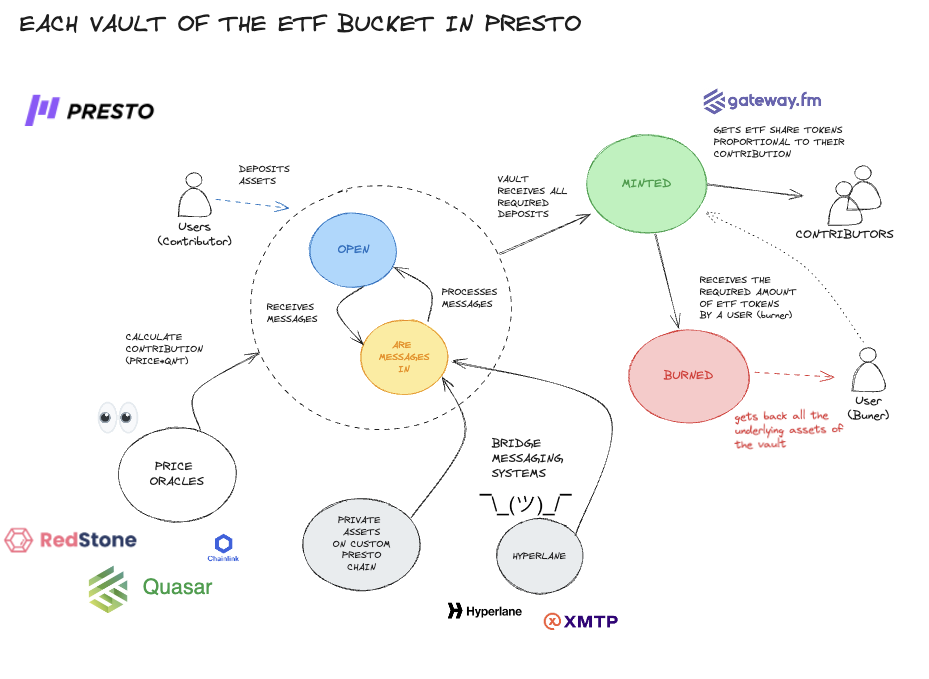

# XTF PROTOCOL

## Encode-Scaling-Ethereum
[Scaling Web3 Hackathon by Encode](https://www.encode.club/scaling-web3-hackathon)

[Youtube Video](https://youtu.be/XFFX6IIjIs4)

[Slide Deck](https://docs.google.com/presentation/d/1Xu0mYl5tPJ1mL1anzwi6o8UegXOMOciamjvTEnzhtPg/edit#slide=id.g2ce5208aab4_0_0)

[Gaetano's contact](https://www.linkedin.com/in/gaetano-mondelli/)


## Description

XTF is a multichain and decentralised version of TradFi ETF.  XTF divides the ETF large bucket into smaller vaults, each mirroring the same asset mix on a smaller scale.This structure allows anyone -not only large organizations- to contribute to a vault’s asset collection and receive ETF share tokens in return.Assets are securely and transparently stored across different chains.We utilise bridges (Hyperlane) to track assets locked on other chains in Etherlink. When all the assets required by a vault are collected on all chains, ETF token shares are issued on Etherlink. The issuance is proportional to each contributor’s investment in the vault. The contribution to each vault depends on the quantity of assets deposited and the price of these assets at the time the vault is completed.Prices are fetched upon vault completion by RedStone.


<!-- gh repo clone hyperlane-xyz/hyperlane-monorepo -->


# XTF ARCHITECTURE


XTF is a multichain protocol, so similar contracts are deployed to different chains. However, we distinguish:

- **Main chain**: The chain that tracks the global state of the assets across chains. It also issues ETF share tokens on vault completion and is the only chain that can burn a vault. In this demo example, **ETHERLINK** is going to be our main chain.

- **Side chain**: Other chains where assets are blocked. After each deposit, they notify the Main chain. Assets can only be released if the main chain sends a *burn* message to them. In this demo example, **ETHERLINK** is going to be our side chain.

---

XTF splits the large ETF bucket into smaller vaults to make investments more manageable. This diagram shows the lifecycle of each vault:

- **Empty**: Initially, the vault is empty, and users can deposit assets.
- **Open**: Some users have deposited assets on the main chain or on some of the tracked side chains.
- **Minted**: All the required assets have been deposited, the underlying assets have been locked, and ETF share tokens have been issued to contributors proportionally to their contributions.
- **Burned**: A user has decided to exchange a determined amount of ETF share tokens back for the underlying assets of the vault.


---

We mentioned that XTF is multi-chain, so we need messages to be exchanged between chains. To achieve that in this demo, we deployed a [Hyperlane](https://www.hyperlane.xyz/) bridge between Sepolia and Etherlink. I have included a convenient [script](https://github.com/GaetanoMondelli/Encode-Scaling-Ethereum/blob/main/create_bridge.sh) that clones the Hyperlane bridge repository, installs Rust, builds the bridge, and runs three components within the same script. It will also handle the script exit by waiting for the processes to exit:

**Sepolia Validator**: This component has a trusted account that, when it sees certain events being emitted, will look up the transaction with the message to exchange, sign it, and make it available to be bridged.
**Etherlink Validator**: Same as the Sepolia validator but for Etherlink.
**Relayer {Sepolia, Etherlink}**: Every time a validator makes validated messages available, it will bridge them to the destination chain.
In the following [folder](https://github.com/GaetanoMondelli/Encode-Scaling-Ethereum/tree/main/bridge/configs), we can find the configuration files used to set up the bridge between Etherlink and Sepolia and the security model used in this configuration.


The supported messages are:

- **Deposit**: From sidechain (Sepolia) to mainchain (Etherlink), to inform the mainchain that a deposit has been made in the sidechain.
- **Burn**: From mainchain (Etherlink) to sidechain (Sepolia), to inform a sidechain that a vault has been burned.
Hyperlane bridges always invoke the handle function with the message. Based on the message, the chain can execute code.

In the beginning, side chain and main chain code were separated into two separate contracts. However, I decided to merge them as having the same contract improved the UI with Viem and Wagmi (see the demo video).


```java
function handle(
		uint32 _origin,
		bytes32 _sender,
		bytes calldata _message
	) external payable {
		require(
			isMainChain() && bytes32ToAddress(_sender) == sideChainLock,
			"Sender to mainChain is not the sideChainLock"
		);

		require(
			!isMainChain() && bytes32ToAddress(_sender) == mainChainLock,
			"Sender to sideChain is not the mainChainLock"
		);


		if(isMainChain()) {
            // Deposit message! Sidechain -> Mainchain
			DepositInfo memory _depositInfo = abi.decode(_message, (DepositInfo));
			// uint32 _chainId = _depositInfo.tokens[0]._chainId;
			_deposit(_depositInfo, chainId);
			return;
		}
		else {
            // Burn message Mainchain -> Sidechain
			uint256 _vaultId = abi.decode(_message, (uint256));
			burn(_vaultId);
		}
	}

```

---

# TOKENOMICS

We also mentioned that when a vault is minted, we need to establish how many ETF Share tokens each user is getting based on their contribution to that vault. The following formula shows how Tmu (total ETF minted per user) is calculated:


For calculating the price of each token (Pti), we use price oracles. In this example, we used Redstone oracles deployed in Etherlink, and for tests, we also added a ChainLink V3 interface.

[ETF contract](etherlink/packages/hardhat/contracts/ETFLock.sol)


```java
import "@redstone-finance/evm-connector/contracts/data-services/RapidDemoConsumerBase.sol";
...
contract ETFLock is RapidDemoConsumerBase {


\\ In the deposit function when we need to calculate the contribution we use Redstone/ chainlink oracle
\\ For simplicity the Redstone one returns always the price for BNB 


		if (isMainChain()) {
				if (accountContributionsPerVault[_vaultId][_tokens[i]._contributor] == 0) {
					contributorsByVault[_vaultId].push(_tokens[i]._contributor);
				}

				bytes32[] memory dataFeedIds = new bytes32[](6);
				dataFeedIds[0] = bytes32("BNB");
				uint256[] memory prices = getOracleNumericValuesFromTxMsg(dataFeedIds);

				uint256 price = prices[0];

...
\\ Or using ChainLink  
		    uint256 price = AggregatorV3Interface(_tokens[i]._aggretator).latestRoundData().answer;
			(, /* uint80 roundID */ int answer, , , ) = AggregatorV3Interface(_tokens[i]._aggregator).latestRoundData();

// contribution calculation

				accountContributionsPerVault[_vaultId][_tokens[i]._contributor] += _tokens[i]
					._quantity * price;

...


```

Please note that the ChainLink oracle is always returning a fixed value decided during deployment.

[MockAggregator.sol](etherlink/packages/hardhat/contracts/MockAggregator.sol)


# TECH STACH


For this demo, I utilizsd Scaffold-Eth to quickly set up a Hardhat project connected to a Next.js React application. This is used with Viem and Wagmi, allowing automatic interaction with the contracts. Additional frontend libraries and resources were employed to improve the user interface, including the Ant Design (antd) React framework, Neobrutalism CSS theme, ApexCharts for vault selection, and React Chart.js for the pie chart.

Smart contract development used Hardhat, with core unit tests (found in the test folder) to verify the contract functionalities. To get familiar with Hyperlane and Redstone, you can find tests for basic use cases of these technologies in the contracts folder and the test folder.

Since assets are securely and transparently stored across different blockchains, we are using QuickNode to access a dedicated Sepolia node. A dedicated node for Etherlink was not necessary during development as the provided RPC URL was sufficient to handle all the traffic.

Note that during the demo, while a Sepolia transaction usually takes a few seconds and requires a refresh, the Etherlink transaction is almost instantaneous, and the refresh of the page is not always necessary.

# Contracts: 

- `ETFLock.sol`: The contract used by both the mainchain and sidechain to handle the deposit of assets, contributions calculation, message exchange, and ETF share token issuance.
- `SimpleERC20.sol`: A simple OpenZeppelin ERC20 token implementation used for representing the assets in the index tracked by the vaults and the ETF share token.
- `ETFSide.sol`: The initial implementation for the ETF lock to be deployed on sidechains.
- `ExampleRedstoneShowroom.sol` & `Rapid.Sol`: Examples of a Redstone contract using Redstone that requires wrapping the library in the frontend. The library was not fully compatible with this version of Scaffold-Eth, and it was much easier to use the Chainlink aggregator for this demo.
- `HyperlaneMessageReceiver.sol`: An example of a Hyperlane-compatible message receiver.
- `HyperlaneMessageSender.sol`: An example of a Hyperlane-compatible message sender.
- `MockAggregator.sol`: A contract implementing the `AggregatorV3Interface` from Chainlink. This is how a price oracle would look like if Etherlink was supported by Chainlink Data Feed.
- `MockRouter.sol` & `TestMailBox.sol`: Mock router for unit-testing the Hyperlane bridge.

# TEST

The [ETFLock.test](etherlink/packages/hardhat/test/ETFLock.ts) checks basic construction and operations of the ETF lock. 


# INTERFACE


The UI was built using [Scaffold eth 2.0](https://github.com/scaffold-eth/scaffold-eth-2) and frontened uses Next.js with React.js. React blockhain hooks to query evm hains were built using `wagmi` and low level interactions were made using `viem`.

The interface displays a large box representing the ETF assets pool, which is divided into smaller vaults to make deposits more manageable. Users can deposit any required tokens into any vault if:
- The vault state is either EMPTY or OPEN (indicated by gray, blue, or orange colors).
- The token is listed in the index (see the required tokens section).
- The deposited token amount does not exceed the required quantity.

``` 
STATES ={
	EMPTY: "No deposit has been made",
	OPEN: "Some deposit have been made",
	MINTED: "All the required deposit have been made, ETF share tokens have been issued to vault's contributors",
	BURNED: "A user has exhanged the right amount of ETF share tokens for redeeming the underlying assets"
}
```

Users are not required to deposit the full amount initially; however, minimum investment thresholds may be introduced in the future to prevent spam. Once all required assets are collected, the vault state changes to MINTED and is highlighted in green. ETF Share tokens are then issued based on the contributions, calculated using Redstone or Chainlink price oracles. The balance of the ETF tokens is shown at the top of the [token balances/allowance section](etherlink/packages/nextjs/app/etf/_components/tokenBalanceAllowance.tsx) below the matrix.

Vault inspection and asset details are accessible by clicking on any vault in the matrix. The [pie chart](etherlink/packages/nextjs/app/etf/_components/PieToken.tsx) displays the value allocation of assets. Precise quantities can be checked by hovering the mouse over the pie chart.

The bottom section, known as the [Required Token Section](etherlink/packages/nextjs/app/etf/_components/DepositController.tsx), provides information on which assets are needed, their quantities, and on which blockchain they reside. Users can edit the quantity they wish to deposit, and for assets on other chains, they can conveniently press the "Select Chain" button to switch chains and display the sidechain contract related to the ETF. This section also allows users to check if they have sufficient allowance for this contract and, if necessary, increase it by clicking "APPROVE" in the required token section.

Finally, the last section includes the [action button](etherlink/packages/nextjs/app/etf/_components/DepositButton.tsx), which displays different operations depending on the chain and vault state:

- Vault [Mainchain, OPEN | EMPTY] => [Deposit]
- Vault [Mainchain, MINTED] => [Burn]
- Vault [Mainchain, BURNED] => []
- Vault [Sidechain, OPEN | EMPTY] => [Deposit, Return to Mainchain]
- Vault [Sidechain, MINTED] => [Return to Mainchain]
- Vault [Sidechain, BURNED] => [Return to Mainchain]


# DEPLOYMENT Script


The following [deployment script](etherlink/packages/hardhat/deploy/02_deploy_etf.ts) deploys all the required assets to run the demo. Note that some pieces were commented out because you run that script in multiple runs.

1. First, you deploy the main chain Etherlink contract with npm run deploy-etherlink, which deploys all required asset tokens in that chain along with price oracles if required.
2. Then, you set the main chain ETFLock address as a constructor parameter for the ETFLock contract in Sepolia.
3. You then run the same script with npm run deploy-sepolia.
4. Finally, we need to re-run the Etherlink part with npm run deploy-etherlink, commenting out the deployment part (to avoid the creation of a new instance) and commenting out the part where we set the sidechain parameter with the address of the sidechain contract deployed in Sepolia.
This information is needed to route messages between different chains.

---

# ZK-ROOL UPS AND LAYER2 (Gateway.fm)

[Youtube demo for Presto Bounty](https://youtu.be/saVjTvExIGA)

## WHY XTF x PRESTO?


It is evident that layer two can be beneficial by such architecture for the following reasons:
- **Control on the Fees, Potentially Eliminating Them**: Using a custom zk-rollup allows for better control over transaction fees, which is crucial for protocols where high transaction volumes are expected, such as in trading or managing ETFs. The aggregation and batch processing of transactions in a rollup can significantly reduce costs compared to executing each transaction individually on the mainnet.

- **Enhanced Scalability**: zk-rollups process transactions off the main Ethereum blockchain but still post transaction data to it. This reduces the load on the mainnet, leading to higher throughput. It’s particularly beneficial for financial protocols like XTF, where numerous transactions and crosschain messages need to be processed efficiently.

- **Running the Protocol in a Controlled Environment Subject to Regulation**: This point is very important for handling regulated assets, often referred to as real-world assets. Custom zk-rollups can be designed to include features that comply with specific regulatory requirements. These might include mechanisms for enhanced KYC and AML  compliance, and the ability to enforce specific rules about who can participate in the network (e.g., via an allowlist of wallet public keys, as mentioned in the [Presto enterprise user's documentation](https://docs-presto.gateway.fm/overview/for-enterprise-customers/presto-customization-options)).
Regarding the specific example of fractionalization projects in the UK, where certain assets were deemed [non-compliant](https://committees.parliament.uk/writtenevidence/116041/html/) because they were identified as non-fungible, this underscores the need for a controlled environment. In cases like whiskey, where individual bottles can be considered unique assets, a custom zk-rollup could be tailored to address these nuances by enforcing specific rules on how assets are tokenized and traded for the [beneficial ownership requirements](https://assets.publishing.service.gov.uk/media/5a80b627e5274a2e87dbb636/UK_EITI_Beneficial_Ownership_Guide_August_2016.pdf).

Implementing a custom zk-rollup provides the flexibility to design a protocol that can adapt to and comply with different regulatory environments, particularly in the context of handling regulated **real-world assets (RWA)**, which are estimated by [**Outlier Venture**](https://outlierventures.io/) to represent a significant market potential, [potentially as high as *$15 trillion by 2030*](https://outlierventures.io/article/draft-tokenization-of-rwas-2024-thesis/). A custom zk-rollup can effectively control transaction fees, by processing large volumes of transactions off-chain while maintaining crucial data on-chain. Furthermore, a controlled environment provided by a custom zk-rollup ensures adherence to regulatory standards, which is crucial for RWAs. This environment can be tailored to include advanced KYC and AML compliance mechanisms, and enforce regulations through an allowlist of wallet public keys, ensuring that only authorized participants engage with the protocol.


## XTF x PRESTO ARCHITECTURE DETAILS




- **Bridge**: Although Presto provides a token bridge via the user interface, XTF necessitates a mechanism for cross-chain communication. Consequently, a Hyperlane bridge was deployed to facilitate message exchanges between the Presto chain and Sepolia, enhancing interoperability across different blockchain networks. Here the ([script-bridge-presto](/create_bridge_zkrollup.sh)) to conveniently deploy all the required components (validators, relayer) 


- **Oracle**: On the new Presto chain, it is possible to note an instance of the Quasar oracle deployed at the chain's startup as shown here [transaction]((https://sn2-stavanger-blockscout.eu-north-2.gateway.fm/address/0x6b83Ba48c05BF480fC7254225BcEAE64E41Faf18)). Deploying a custom Quasar oracle is straightforward using this [repository](https://github.com/gateway-fm/quasar-contract?tab=readme-ov-file). For this particular demonstration, the [Quasar oracle](gateway.fm/packages/hardhat/contracts/Quasar.sol) was employed to ensure reliable data feeds and smart contract executions.

[ETFLock (gaetway.fm)](gateway.fm/packages/hardhat/contracts/ETFLock.sol)
```java
			if (isMainChain()) {
				if (accountContributionsPerVault[_vaultId][_tokens[i]._contributor] == 0) {
					contributorsByVault[_vaultId].push(_tokens[i]._contributor);
				}
				// Quasar Interface
				uint256 price = IQuasar(quasarAddress).getPrice(_tokens[i]._tokenId);

				accountContributionsPerVault[_vaultId][_tokens[i]._contributor] += _tokens[i]
					._quantity * price;
			}
```

Given the [partnership](https://twitter.com/redstone_defi/status/1707412621237141675) between Redstone and Presto, it is also possbile to integrate [Redstone oracles](gateway.fm/packages/hardhat/contracts/Rapid.sol) into the Presto platform. Note that this integration will necessitate wrapping frontend calls with the Redstone SDK.


[ETFLock (gaetway.fm)](gateway.fm/packages/hardhat/contracts/ETFLock.sol)
```java
			if (isMainChain()) {
				if (accountContributionsPerVault[_vaultId][_tokens[i]._contributor] == 0) {
					contributorsByVault[_vaultId].push(_tokens[i]._contributor);
				}


				// REDSTONE INTERFACE
				bytes32[] memory dataFeedIds = new bytes32[](6);
				dataFeedIds[0] = bytes32("ASSET_ID");
				uint256[] memory prices = getOracleNumericValuesFromTxMsg(dataFeedIds);

				accountContributionsPerVault[_vaultId][_tokens[i]._contributor] += _tokens[i]
					._quantity * price;
			}
```

It is also possible to utilize the standard [V3Aggregator](gateway.fm/packages/hardhat/contracts/MockAggregator.sol) interface from *Chainlink* by changing just one line of code.


# OPEN ISSUES

1. Hyperlane's Bridge sometimes loses some messgaes (https://discord.com/channels/935678348330434570/1226115716957208586) **Mitigation**: Protocol messages to be idempotent to be message-lost-issues resistant 

2. Redstone wrapper sdk library comaptibility with Hardhat v6.0 (https://discord.com/channels/786251205008949258/992359929467895838/1228301971568590929)
**Mitigation**: Using [@ethersproject](https://www.npmjs.com/search?q=%40ethersproject%2F) library for legacy (and depreated support) of old ethers functions. Losing some og the usability and sempliity of Hardhat but works as per this [deployment test sccript](etherlink/packages/hardhat/deploy/01_deploy_oracle.ts) 